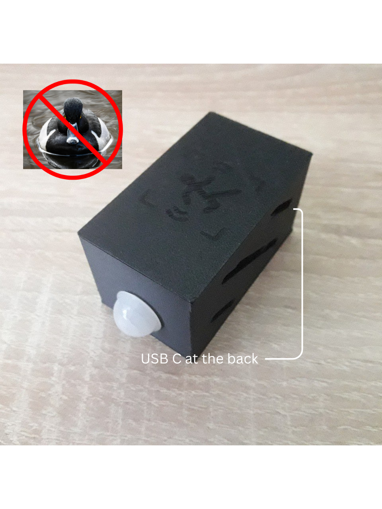

# ESP32 Motion Detector with Telegram Notifications 🚨📱

This project uses an **ESP32 with USB-C**, a **mini PIR motion sensor**, and the **Telegram Bot API** to send you a message whenever motion is detected.  
It’s simple, fun, and actually useful as a small home security helper!  

---

## 🔧 Hardware Setup
You will need:  
- 1x ESP32 (USB-C version in my case)  
- 1x Mini PIR sensor  
- Some jumper wires  

Connections:  
- **PIR Sensor Output → GPIO 15**  
- **PIR VCC → 3.3V** (⚠ some PIR sensors also work with 5V, check your model)  
- **PIR GND → GND**  

The ESP32 also uses its **internal LED (GPIO 2)** for status/error codes.  

---

## 💻 Software Setup

### 1. Install Arduino IDE and libraries
You’ll need:  
- [Arduino IDE](https://www.arduino.cc/en/software)  
- ESP32 board support (via Board Manager)  
- Libraries:  
  - `WiFi.h`  
  - `WiFiClientSecure.h`  
  - `UniversalTelegramBot.h`  
  - `ArduinoJson.h`  
  - `EEPROM.h`  

---

### 2. Create your Telegram Bot
1. Open Telegram and search for **BotFather**.  
2. Start a chat and type `/newbot`.  
3. Give your bot a name and username.  
4. BotFather will send you a **Bot Token** → copy it!  

Replace in the code:  
```cpp
#define BOTtoken "yourbottoken"
```

---

### 3. Get your Chat ID
1. Open Telegram and search for **@userinfobot** (or use any "Get IDs" bot).  
2. Start it, type `/start`, and it will show your **chat ID**.  
3. Replace in the code:  
```cpp
#define CHAT_ID "yourchatid"
```

---

### 4. Configure WiFi
Replace with your own WiFi credentials in the code:  
```cpp
const char* ssid = "yourwifissid";
const char* password = "yourwifipassword";
```

---

## ▶️ Upload and Run
1. Connect your ESP32 via USB-C.  
2. Select the right board and port in Arduino IDE.  
3. Upload the code.  
4. Open Serial Monitor to check logs.  

Once motion is detected, you should receive a Telegram message like:  
```
INFO: Motion detected!
```

---

## ✨ Features
- Motion detection using a PIR sensor  
- Sends Telegram messages within ~5 seconds  
- Internal LED blinks on success or stays on error  
- WiFi reconnect and restart handling  
- Basic `/status` and `/again` commands via Telegram  

---

You can also modify the code, for your needs. Like changing the messages or more, feel free to have fun with it :D.

---

## 📸 Media

### Title image


### Picture 1


---

## 📖 License

MIT License – free to use, modify, and share.